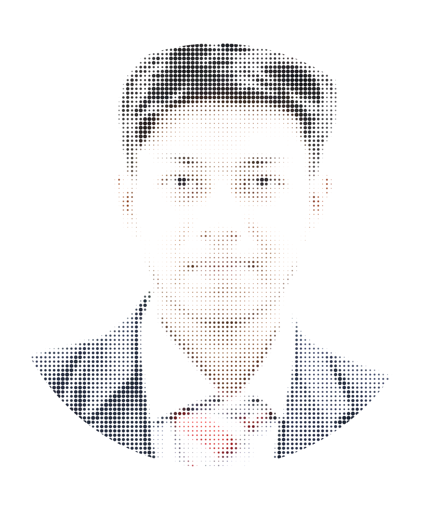
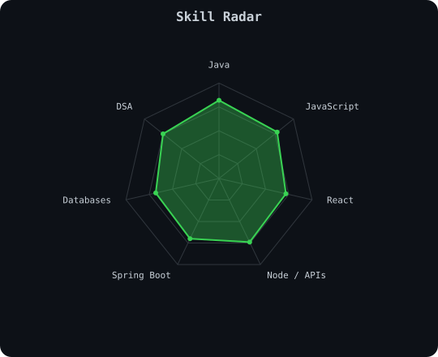
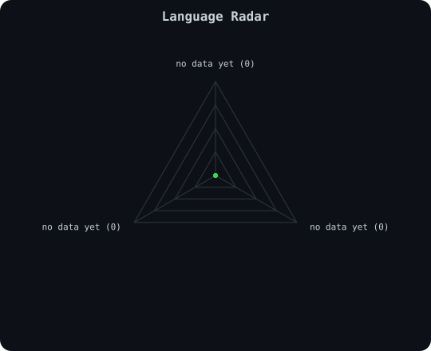
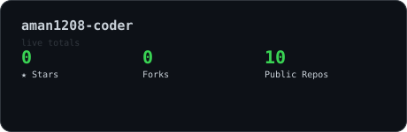
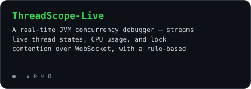
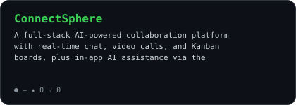
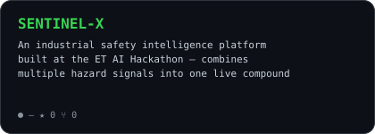
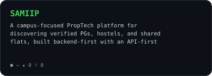

<div align="center">

<picture>
  <source media="(prefers-color-scheme: dark)" srcset="assets/portrait-mono-dark.svg">
  <source media="(prefers-color-scheme: light)" srcset="assets/portrait-mono-light.svg">
  
</picture>


<a href="https://linkedin.com/in/aman-kumar-1aa018375"></a>
<a href="mailto:itsmj1208@gmail.com"></a>
<a href="https://leetcode.com/u/amanreings_07"></a>
<a href="https://github.com/aman1208-coder"></a>


</div>

<br>

## `~/` whoami

```console
$ cat about.txt
```

Hi, I'm **Aman Kumar** — a Computer Science student who builds full-stack, real-time systems in Java and JavaScript, and likes projects that touch real concurrency and infra problems instead of just CRUD.

- Currently building **[ThreadScope Live](https://github.com/aman1208-coder)** — a real-time JVM concurrency debugger
- CGPA: **8.0** at Graphic Era University, Dehradun
- Learning **distributed systems fundamentals** and **system design**
- Fun fact: I once debugged a MongoDB duplicate-key error into a sparse-index fix at 2am

<br>

## `~/` toolbox

<div align="center">


</div>

<br>

## `~/` skill radar

<table>
<tr>
<td width="50%" align="center">

<picture>
  <source media="(prefers-color-scheme: dark)" srcset="assets/radar-dark.svg">
  <source media="(prefers-color-scheme: light)" srcset="assets/radar-light.svg">
  
</picture>

</td>
<td width="50%" align="center">

<picture>
  <source media="(prefers-color-scheme: dark)" srcset="assets/radar-langs-dark.svg">
  <source media="(prefers-color-scheme: light)" srcset="assets/radar-langs-light.svg">
  
</picture>

</td>
</tr>
</table>

<br>

## `~/` stats

<div align="center">

<picture>
  <source media="(prefers-color-scheme: dark)" srcset="assets/stats-dark.svg">
  <source media="(prefers-color-scheme: light)" srcset="assets/stats-light.svg">
  
</picture>

</div>

<br>

## `~/` projects

<table>
<tr>
<td width="50%">

<a href="https://github.com/aman1208-coder/ThreadScope-Live">
<picture>
  <source media="(prefers-color-scheme: dark)" srcset="assets/card-threadscope-live-dark.svg">
  <source media="(prefers-color-scheme: light)" srcset="assets/card-threadscope-live-light.svg">
  
</picture>
</a>

</td>
<td width="50%">

<a href="https://github.com/aman1208-coder/ConnectSphere">
<picture>
  <source media="(prefers-color-scheme: dark)" srcset="assets/card-connectsphere-dark.svg">
  <source media="(prefers-color-scheme: light)" srcset="assets/card-connectsphere-light.svg">
  
</picture>
</a>

</td>
</tr>
<tr>
<td width="50%">

<a href="https://github.com/aman1208-coder/SENTINEL-X">
<picture>
  <source media="(prefers-color-scheme: dark)" srcset="assets/card-sentinel-x-dark.svg">
  <source media="(prefers-color-scheme: light)" srcset="assets/card-sentinel-x-light.svg">
  
</picture>
</a>

</td>
<td width="50%">

<a href="https://github.com/aman1208-coder/SAMIIP">
<picture>
  <source media="(prefers-color-scheme: dark)" srcset="assets/card-samiip-dark.svg">
  <source media="(prefers-color-scheme: light)" srcset="assets/card-samiip-light.svg">
  
</picture>
</a>

</td>
</tr>
</table>

<sub>

| Project | Stack | Link |
|---|---|---|
| ThreadScope Live | Java 17, Spring Boot, LMAX Disruptor, WebSocket | [repo](https://github.com/aman1208-coder/ThreadScope-Live) |
| ConnectSphere | React, Node.js/Express, MongoDB, Socket.IO, OpenAI API | [repo](https://github.com/aman1208-coder/ConnectSphere) |
| SENTINEL-X | FastAPI, React, WebSocket, JWT/RBAC | [repo](https://github.com/aman1208-coder/SENTINEL-X) |
| SAMIIP | FastAPI, PostgreSQL, JWT | [repo](https://github.com/aman1208-coder/SAMIIP) |

</sub>

<br>

## `~/` activity

<div align="center">


<br><br>

<picture>
  <source media="(prefers-color-scheme: dark)" srcset="https://raw.githubusercontent.com/aman1208-coder/aman1208-coder/output/snake-dark.svg">
  <source media="(prefers-color-scheme: light)" srcset="https://raw.githubusercontent.com/aman1208-coder/aman1208-coder/output/snake-light.svg">
  
</picture>

</div>

<br>

<div align="center">

01100010 01110101 01101001 01101100 01100100 00100000 01110011 01101111 01101101 01100101 01110100 01101000 01101001 01101110 01100111

</div>
